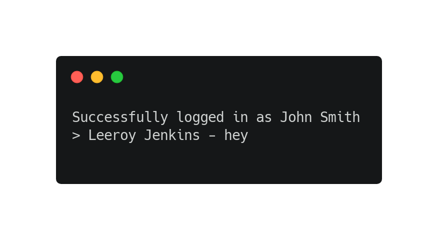
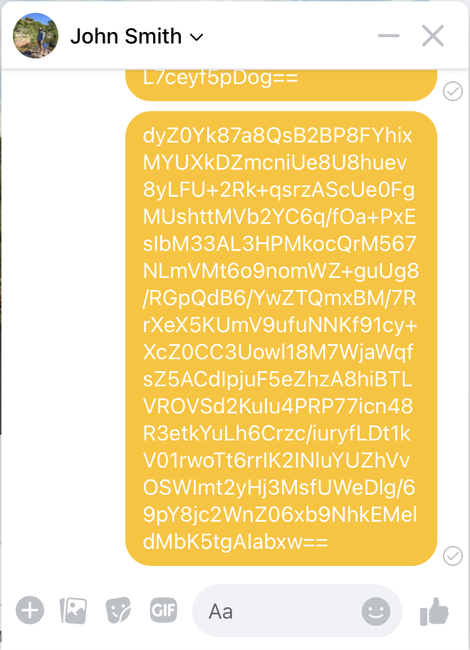

# Zuccnet

End-to-end Encrypted Facebook Messenger


Zuccnet is a fork of [https://github.com/mjkaufer/messer](messer), a command-line client for Facebook Messenger. Only difference is, Facebook can't read your messages.

It is known that [Facebook scans your messages](https://www.digitaltrends.com/social-media/facebook-reads-messenger-messages/). If you need to keep using Facebook messenger but care about privacy, Zuccnet might help.

It's pretty simple: you and your friend have Zuccnet installed. Your friend gives you their Zuccnet public key. Then, when you send a message to your friend on Zuccnet, your message is encrypted on your machine before it is sent across Facebook to your friend. Then, your friend's Zuccnet decrypts the message. Facebook never sees the content of your message.

I'm not a security person and there's probably some stuff I've missed - any contributions are very welcome! This is _very_ **beta**, don't take it too seriously.

| What your friend sees              | What Facebook sees     |
| ---------------------------------- | ---------------------- |
|  |  |

## Quick Start

> `node` version 12.x required

1. Install `zuccnet`

   ```bash
   $ npm install -g zuccnet
   ```

2. Run `zuccnet`

   ```bash
   $ zuccnet
   ```

3. Enter your login details (your username and password are not stored)

4. Get your friend's public key, and assign it to them in Zuccnet

   ```bash
   $ public_key "John Smith" /Users/tomquirk/Downloads/johns_id_rsa.pub
   ```

5. Send them a message

   ```
   $ message "John Smith" Hey John, this is a super secret message
   ```

6. 🪄

## FAQ

### Do you store any of my data?

**_We don't store your username, password, or any of your interactions on Zuccnet_**.

The only thing we store is a temporary login token when you first log in. This let's us authenticate you with Facebook _without_ you having to enter your username and password every time. If you want to get rid of it, simply run `zuccnet cleanup`, or if you're in a Zuccnet session, run the `logout` command.

### Can I use a deactivated Facebook account?

No, unforunately not. If you use Zuccnet with a deactivated Facebook account, your account will be reactivated.

### How do group chats work?

Messages from group chats appear like

```bash
(My cool friends) John Smith - hey guys!!$$@@
```

Send a message to a group by using the `message` command. The `name` is the name of the group chat! Reply works as normal

## Commands Reference

#### `message`

Sends a _message_ to a given _user_

```bash
(message | m) "<user>" <message>
```

Examples

- `message "Matthew" hello world!`
- `m "Matthew" hello world!`

When sending a message, Zuccnet picks the closest match to what you type in as `user`. For this reason, you should probably use last names if you want to avoid accidentally texting someone.

#### `reply`

Replys to the last message you recevied i.e. Sends a message to the user of the most recently received message.

```bash
(reply | r) <message>
```

Example

- `r "hey yo this is my reply"`

Note: this will only work if you have received at least one message through Zuccnet.

#### `contacts`

Lists all of your Facebook friends

```bash
contacts
```

#### `history`

Displays the last _n_ messages in the conversation with a given user. The number of messages to retrieve are optional (default is 5).

```bash
(history | h) "<user>" [<n>]
```

Examples

- `history "Matthew" 10`
- `h "Matthew"`

#### `recent`

Displays the _n_ most recent conversations. The number of threads is optional (default is 5).
The `--history` option will display the 5 most recent messages in each thread.

```bash
recent [<n>] [--history]
```

Examples

- `recent`
- `recent 10`
- `recent --history`

#### `clear`

Clears the number of unread messages in the window title. Since we cannot listen on focus events, it has to be done manually.

```bash
(clear | c)
```

#### `logout`

Logs you out

```bash
logout
```

#### `mute`

Mutes a thread. If no seconds are specified, the thread is muted indefinetely.

```bash
mute "<thread-name>" [seconds]
```

#### `unmute`

Unmutes a thread

```bash
unmute "<thread-name>"
```

#### `settings`

Configure your user settings on Zuccnet

```bash
settings (set | get | list) [<key>=<value>]
```

Examples

- `settings list`
- `settings get SHOW_READ`
- `settings set SHOW_READ=true`

For supported settings, see section below

### Supported Settings

- `SHOW_READ`
  - Marks conversation as "read" when using `clear` command

### Lock-on Mode

Locking on to a user or group allows you to send messages without having to specify the `message` command; just type away!

```bash
lock "Tom Q"
```

**To unlock**, simply run:

```bash
--unlock
```

### Secret Mode

When in this mode, any messages sent or recieved in the thread will be deleted for you (note, **they won't be deleted for everyone**).

```bash
lock "Tom Q" --secret
```

### Non-interactive Mode

Zuccnet can be run in non-interactive mode with command line arguments to execute a single command.

```bash
zuccnet --command='<command>'
```

Login will be prompted if this is the first time logging in.

Examples

- `zuccnet --command='m "John Smith" Hey, John'`
- `zuccnet --command='r Hey, John'`

### Cleanup

If ever you want to clean up any old Zuccnet sessions and start from scratch, run:

```bash
$ zuccnet cleanup
```

## Contributing

Want to add a new command, fix a bug or improve Zuccnet in another way? Please read CONTRIBUTING.md for details on our code of conduct, and the process for submitting pull requests to us.

## License

This project is licensed under the ISC License - see the LICENSE file for details
